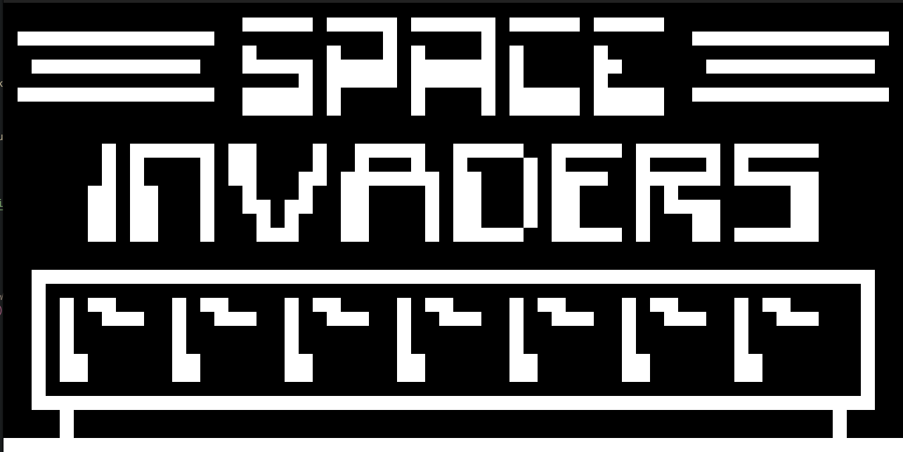

<!--
*** This readme was adapted from Best-README-Template.
  https://github.com/othneildrew/Best-README-Template
-->

<!-- PROJECT SHIELDS -->
<!--
*** I'm using markdown "reference style" links for readability.
*** Reference links are enclosed in brackets [ ] instead of parentheses ( ).
*** See the bottom of this document for the declaration of the reference variables
*** for contributors-url, forks-url, etc. This is an optional, concise syntax you may use.
*** https://www.markdownguide.org/basic-syntax/#reference-style-links
-->
<div align="left">

[![Contributors][contributors-shield]][contributors-url]
[![Forks][forks-shield]][forks-url]
[![Stargazers][stars-shield]][stars-url]

</div>

<a href="https://github.com/Kaweees/chip8">
  
</a>

<div align="left">
  <h1><em><a href="https://github.com/Kaweees/chip8">~chip8</a></em></h1>
</div>

<!-- ABOUT THE PROJECT -->

An emulator and implementation of the CHIP-8 processor written in C++20

### Built With

[![C++][C++-shield]][C++-url]
[![NixOS][NixOS-shield]][NixOS-url]
[![CMake][CMake-shield]][CMake-url]
[![GitHub Actions][github-actions-shield]][github-actions-url]

<!-- PROJECT PREVIEW -->
## Preview

<p align="center">
  
</p>

<!-- GETTING STARTED -->
## Getting Started

### Prerequisites

Before attempting to build this project, make sure you have [Nix](https://nixos.org/download.html) installed on your machine.

### Installation

To get a local copy of the project up and running on your machine, follow these simple steps:

1. Clone the project repository

   ```sh
   git clone https://github.com/Kaweees/chip8.git
   cd chip8
   ```

2. Install the project dependencies

   ```sh
   nix-shell --max-jobs $(nproc) # Linux / Windows (WSL)
   nix-shell --max-jobs $(sysctl -n hw.ncpu) # macOS
   ```

3. Build the project

   ```sh
   just build
   ```

4. Run the project

   ```sh
   just run invaders ./rom/space-invaders.ch8
   ```

<!-- PROJECT FILE STRUCTURE -->
## Project Structure

```sh
chip8/
├── .github/                       - GitHub Actions CI/CD workflows
├── include/                       - project header files
├── src/                           - project source files
│   └── main.c                     - Entry point, main function
├── CMakeLists.txt                 - CMake build script
├── LICENSE                        - project license
└── README.md                      - you are here
```

## License

The source code for [Kaweees/chip8](https://github.com/Kaweees/chip8) is distributed under the terms of the GNU General Public License v3.0, as I firmly believe that collaborating on free and open-source software fosters innovations that mutually and equitably beneficial to both collaborators and users alike. See [`LICENSE`](./LICENSE) for details and more information.

<!-- MARKDOWN LINKS & IMAGES -->
<!-- https://www.markdownguide.org/basic-syntax/#reference-style-links -->

[contributors-shield]: https://img.shields.io/github/contributors/Kaweees/chip8.svg?style=for-the-badge
[contributors-url]: https://github.com/Kaweees/chip8/graphs/contributors
[forks-shield]: https://img.shields.io/github/forks/Kaweees/chip8.svg?style=for-the-badge
[forks-url]: https://github.com/Kaweees/chip8/network/members
[stars-shield]: https://img.shields.io/github/stars/Kaweees/chip8.svg?style=for-the-badge
[stars-url]: https://github.com/Kaweees/chip8/stargazers

<!-- MARKDOWN SHIELD BAGDES & LINKS -->
<!-- https://github.com/Ileriayo/markdown-badges -->
[C++-shield]: https://img.shields.io/badge/C++-%23008080.svg?style=for-the-badge&logo=c%2B%2B&logoColor=004482&labelColor=222222&color=004482
[C++-url]: https://isocpp.org/
[NixOS-shield]: https://img.shields.io/badge/NIX-%23008080.svg?style=for-the-badge&logo=NixOS&logoColor=5277C3&labelColor=222222&color=5277C3
[NixOS-url]: https://nixos.org/
[CMake-shield]: https://img.shields.io/badge/CMake-%23008080.svg?style=for-the-badge&logo=cmake&logoColor=008FBA&labelColor=222222&color=008FBA
[CMake-url]: https://cmake.org/
[github-actions-shield]: https://img.shields.io/badge/github%20actions-%232671E5.svg?style=for-the-badge&logo=githubactions&logoColor=2671E5&labelColor=222222&color=2671E5
[github-actions-url]: https://github.com/features/actions
